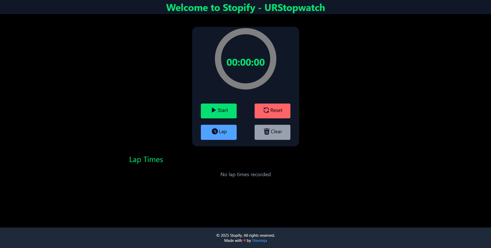
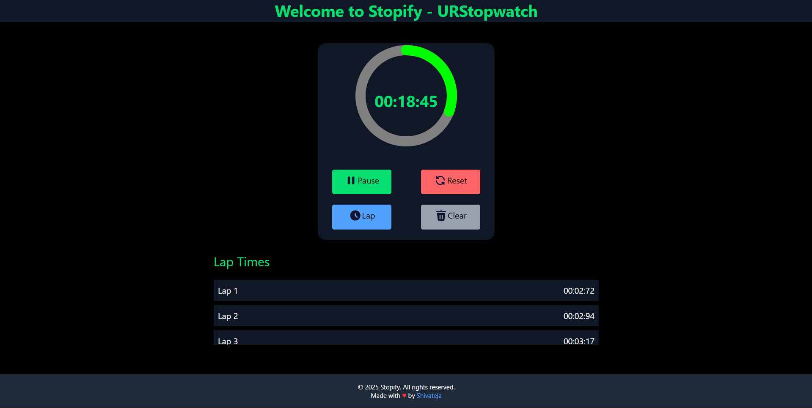

# Stopwatch Web Application

This repository contains a stopwatch web application, built as my second task during my internship at **SkillCraft Technology**.

## Project Overview

- **Task:** Create an interactive and user-friendly stopwatch web application.
- **Technologies Used:**
  - HTML
  - [Tailwind CSS](https://tailwindcss.com/)
  - JavaScript
- **Features:**
  - Start, stop, and reset stopwatch functionality.
  - Lap recording: Save multiple laps during a timing session.
  - Clear laps: Remove all recorded laps with a single click.
  - Animated icons for interactive actions.
  - Responsive design for mobile, tablet, and desktop.
  - Intuitive user interface styled with Tailwind CSS.

## Pages & Previews

### Main Stopwatch Page


### Animated Icons & Controls


## Getting Started

### Prerequisites

- Any modern web browser (Chrome, Firefox, Edge, etc.)
- No build tools required if using Tailwind CSS CDN.

### Run Locally

1. Clone the repository:
    ```bash
    git clone https://github.com/shivateja-droid/SCT_WD_2.git
    ```
2. Open the `index.html` file in your browser.

If you want to use Tailwind via npm and build tools, refer to [Tailwind Installation Guide](https://tailwindcss.com/docs/installation).

## Folder Structure

- `index.html` — Main HTML file.
- `style.css` — Custom styles (if any).
- `script.js` — JavaScript file for stopwatch logic and interactions.
- `images/` — Contains images/screenshots for previews.

## License

This project is provided for educational purposes as part of the SkillCraft Technology internship.

## Author

- **shivateja-droid**

---

Visit the [live demo](https://shivateja-droid.github.io/SCT_WD_2/) for an interactive experience.
